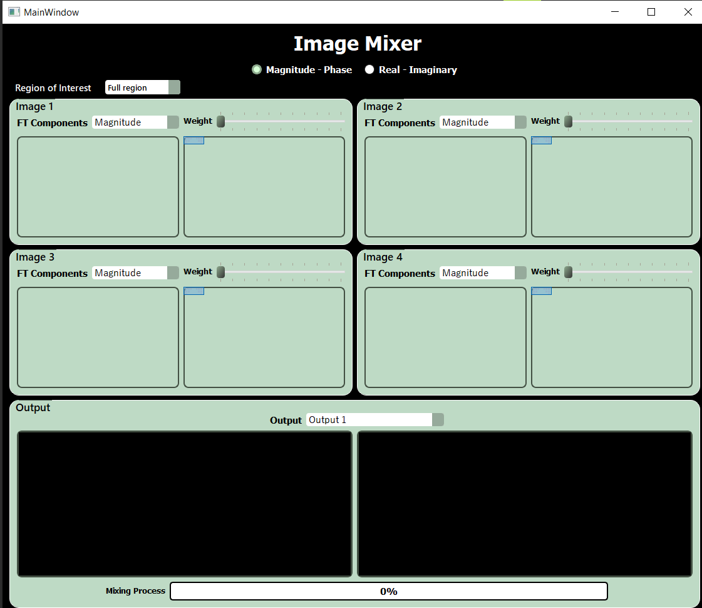

# Fourier Transform Mixer
A desktop program that explains the relative importance of the magnitude and phase
components as well emphasizing the frequencies' different contributions to the signal. It is done on 2D signals
(i.e. images) just for clarity but the same concept applies to any signal.

## Table of Contents

- [Features](#features)
- [Usage](#usage)

## Features

- **Opening Images:** Open up to 4 images for visualization and processing.

- **Visualize Image Components:** Visualize the 4 components of each image: FT magnitude, FT phase, FT real, and FT imaginary components.

- **Real-time Brightness and Contrast Control:** Adjust the brightness and contrast.

- **Image Mixer:** Create a new image by mixing either the phase and magnitude or the imaginary and real components of 2 images in an intuitve way.

- **Regions Mixer:** Mask the regions you want to mix with a single click and drag.

## Usage

1. **Open Images:**

   - Double click the "image port" to select an image for visualization.

2. **Contrast  Control:**

   - Scroll your cursor vertically for brightness control.

3. **Brightness  Control:**

   - Scroll your cursor horizontally for brightness control.

4. **Image Mixer:**

   - Choose either the whether magnitude/phase or real/imaginary mixing mode .
   - Use sliders to adjust the components weights percentages.
   - Choose output 1 or 2 to show the result.

4. **Regions Mixer:**

   - Choose either the full, inner or outer region mode then use the mouse to select your ROI for the output.

## Preview

